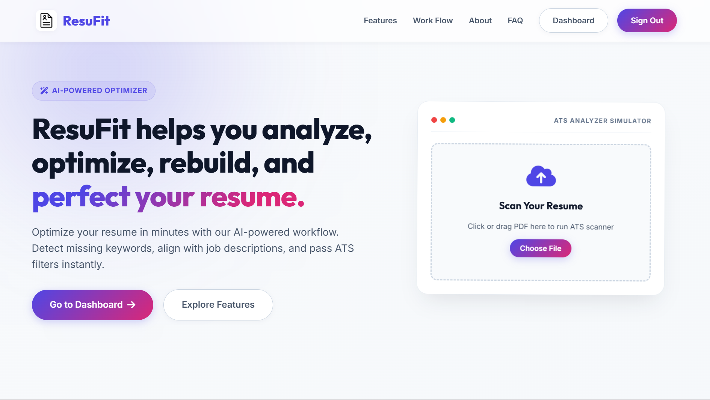

# ResuFit - AI Resume Intelligence & ATS Optimizer

ResuFit is a premium, AI-powered Resume Analyzer, Job Description Matcher, and Interactive Resume Builder designed to help job seekers bypass Applicant Tracking Systems (ATS) and instantly impress recruiters. By combining modern LLM parsing, real-time keyword analysis, and dynamic layout template rendering, ResuFit shifts resume building from a guess-work chore into a streamlined, data-driven workflow.



---

## 🚀 Key Features

* **AI-Powered ATS Score Analysis**: Extracts layout nodes, text flow, and structure to grade your resume on readability, formatting, and keyword density.
* **Smart Job Description Matcher**: Paste your target job description to run a direct gap analysis. Isolate matched and missing industry-specific keywords, and receive tailored certification recommendations.
* **Interactive Resume Builder Wizard**: Step-by-step wizard to build a clean, A4 single-page resume with character-by-character live typing previews.
* **Multi-Template Layout Gallery**: Instantly toggle between **8 distinct professional templates** (Slate, Modern Corporate, Executive Minimalist, Monospace, Academic, etc.) and see formatting update in real-time.
* **Instant Resume Tailoring**: Leverage Llama 3 / 3.3 models via Groq to rewrite professional summaries and experience bullet points to match your target job description automatically.
* **Scanned Resume OCR Fallback**: Integrated OCR parser using PyMuPDF and Tesseract to extract readable text even from image-only scan PDFs.

---

## 🛠️ Tech Stack

* **Backend Framework**: Python 3.13 / Flask
* **Artificial Intelligence**: Groq API (Llama-3.3-70b-versatile, Llama-3.1-8b-instant)
* **Text & Image Parsing (OCR)**: PyMuPDF (fitz), Pillow (PIL), and Tesseract OCR
* **Frontend**: HTML5, Vanilla CSS3 (modern glassmorphic styling, CSS Grid, Flexbox, custom variables), and Vanilla JavaScript
* **Database**: SQLite3 (user records, session caching)
* **Video/Automation Testing**: Playwright (Python implementation)

---

## 📂 Project Directory Structure

```text
ResuFit/
├── static/               # Client-side style assets
│   ├── style.css         # Main theme styling (glassmorphic layouts)
│   ├── auth_split.css    # Authentication split UI styling
│   └── resufit.css       # Layout customizations and helper variables
├── templates/            # HTML templates for Flask pages
│   ├── index.html        # Landing page
│   ├── home.html         # User dashboard (ATS analysis, job fit tabs)
│   ├── builder.html      # Interactive resume builder wizard & gallery
│   ├── signin.html       # Email authentication page
│   ├── signup.html       # Email sign up registration page
│   ├── forgot-password.html
│   ├── new-pass.html     # Reset password form
│   └── verify.html       # OTP check page
├── uploads/              # Server-side directory for resume PDF storage
├── app.py                # Core Flask backend routes, DB handlers, and API endpoints
├── ocr.py                # Text parsing and Tesseract OCR engine fallback
├── groq_ai.py            # LLM API interface (analysis, grading, tailoring)
├── database.db           # SQLite database for storing accounts and uploads metadata
├── requirements.txt      # Python dependencies list
└── sample_resume.pdf     # Pre-generated test resume file
```

---

## 📦 Installation & Setup

Follow these steps to run ResuFit locally on your machine:

### 1. Prerequisites
Ensure you have **Python 3.13+** installed. If you plan on using the scanned OCR fallback, download and install [Tesseract OCR](https://github.com/UB-Mannheim/tesseract/wiki) and ensure it is added to your environment path.

### 2. Clone & Setup Environment
Open your shell in the project folder and create a virtual environment:
```powershell
python -m venv env
.\env\Scripts\activate
```

### 3. Install Dependencies
Install all the required python libraries listed in `requirements.txt`:
```powershell
pip install -r requirements.txt
```

### 4. Configure Environment Variables
Create a file named `.env` in the root directory and configure the environment variables:

| Variable | Description | Example / Default Value | Required |
| :--- | :--- | :--- | :--- |
| `secret_key` | Flask session encryption key | `some_random_secret_string` | **Yes** |
| `groq_api_key` | Groq API Key for Llama 3 models | `gsk_xxxxxxxxxxxxxxx` | **Yes** |
| `OAUTHLIB_INSECURE_TRANSPORT` | Bypass HTTPS constraint for local OAuth testing | `1` | **Yes** (locally) |
| `EMAIL_USER` | Gmail address for sending verification OTPs | `your_email@gmail.com` | No (fallback works) |
| `EMAIL_PASS` | Gmail App Password for SMTP authentication | `abcd efgh ijkl mnop` | No (fallback works) |
| `client_id` | Google OAuth Client ID | `xxxxx.apps.googleusercontent.com` | No (local login works) |
| `client_secret` | Google OAuth Client Secret | `GOCSPX-xxxxxxxxxxxxx` | No (local login works) |
| `redirect_uri` | Google OAuth Redirect URI | `http://localhost:5000/callback` | No (local login works) |

Example `.env` configuration:
```env
secret_key = YourFlaskSecretKey
groq_api_key = YourGroqApiKeyHere
OAUTHLIB_INSECURE_TRANSPORT = 1
```

### 5. Launch the Server
Start the Flask application:
```powershell
python app.py
```
Open your browser and navigate to `http://localhost:5000` to access the application.

---

## 📖 How to Use Guide

1. **Scan Your Current Resume**: Click "Choose File" on the Landing Page simulator or click "Sign In" (credentials: `test@example.com` / `Password123!`) to open the main **Dashboard**. Upload a PDF to view your ATS score, strengths, and suggestions.
2. **Scan Job Description Gaps**: Navigate to the **Job Fit Analysis** tab, paste the target job description, select your resume file, and click "Submit". Review missing keywords and recommendations.
3. **Build from Scratch**: Go to the **Resume Builder** tab and click "Create New Resume". Use the step-by-step wizard on the left. Watch the A4 template preview on the right update dynamically as you type.
4. **Tailor to Job Description**: In the builder finish tab, paste a job description into the tailoring input box and click "Tailor Resume". The AI will rewrite achievements and descriptions directly in the live A4 preview.
5. **Cycle Templates**: Use the layout selector sidebar to cycle between Templates 1 to 8 to find the visual format that fits your industry.

## 🎥 Video Walkthrough Demo

A full-screen, laptop-resolution (`1366x768`) video demo of the entire application workflow has been recorded using Playwright automation. It showcases the landing page scrolling, user login, ATS score analysis, Job Fit comparison, builder typing animations, and template cycles.

### 🎬 Live Demo Walkthrough

<video width="100%" src="./resufit_walkthrough.webm" controls>
  <source src="./resufit_walkthrough.webm" type="video/webm">
  Your browser does not support the video tag.
</video>

---

## 🔗 Live Application Link

Experience the live version of **ResuFit** deployed on Render:

[](https://resufit-517i.onrender.com/)

> 🌐 **Production URL:** [https://resufit-517i.onrender.com/](https://resufit-517i.onrender.com/)
> 

---

## ⚡ Live Demo Walkthrough Guide

To explore the live deployment of **ResuFit** without setting up the project locally:

### 1. 🔑 Pre-configured Login
Use this pre-configured test account to sign in immediately:
* **Email:** `test@example.com`
* **Password:** `Password123!`

*(Alternatively, you can register a new account directly on the signup page).*

### 2. 📄 Ready-to-use Sample Data
Use these sample materials to test the core features of the platform:

* **Sample Resume File**: Download and use the pre-generated **[sample_resume.pdf](./sample_resume.pdf)** file from this repository to test the **ATS Analyzer** or **Job Fit Matcher**.
* **Sample Job Description**: Copy and paste the text block below to test the **Job Fit Analysis** or the **AI Tailoring Engine**:
  ```text
  Senior Backend / ML Engineer
  Requirements:
  - 5+ years of experience with Python and Flask.
  - Experience with SQL databases (PostgreSQL/SQLite).
  - Experience with cloud platforms (AWS, Docker).
  - Knowledge of PyTorch, NLP models, and API optimization.
  ```

### 3. 🎯 Step-by-Step Test Flows
* **Flow A (ATS Score)**: Log in ➡️ Upload the `sample_resume.pdf` ➡️ Review the generated score breakdown, keyword analysis, and suggestions.
* **Flow B (Job Fit & Recommendations)**: Navigate to the **Job Fit Analysis** tab ➡️ Paste the Sample Job Description ➡️ Select `sample_resume.pdf` ➡️ Submit to view keyword gaps and certification suggestions.
* **Flow C (Resume Builder & AI Tailoring)**: Navigate to the **Resume Builder** tab ➡️ Click **Create new resume** ➡️ Type details (or use the preloaded template) ➡️ Navigate to the **Finish** tab ➡️ Paste the Sample Job Description ➡️ Click **Tailor Resume** to see the achievements rewrite in real-time.

---

## ⚙️ Technical Architecture & Details

### 🗄️ Database Schema (SQLite)

The application stores user credentials and uploads metadata in a local SQLite file (`database.db`) consisting of two main tables:

1. **`users` Table**:
   * `id`: `INTEGER` (Primary Key Auto-Increment)
   * `email`: `TEXT` (Unique, Not Null)
   * `password`: `TEXT` (Hashed password using Werkzeug)
   * `provider`: `TEXT` (Authentication source: `signup` or `google`)

2. **`uploads` Table**:
   * `id`: `INTEGER` (Primary Key Auto-Increment)
   * `file_path`: `TEXT` (Local path of the uploaded resume PDF)
   * `uploaded_at`: `TIMESTAMP` (Upload timestamp, defaults to current time)

---

### 🌐 Key Backend API Endpoints (Flask)

* `GET /`: Renders the landing page with user statistics.
* `POST /signin` / `POST /signup`: Authenticates users and registers new accounts.
* `GET /home`: Renders the user dashboard interface (authorized only).
* `POST /upload`: Handles PDF upload, triggers OCR/PyMuPDF text extraction, calls Groq AI grading, and returns parsed resume insights in JSON.
* `POST /analyze_job`: Takes the uploaded resume text and a job description, performs Gap Analysis, and returns matched/missing keywords and certifications.
* `GET /builder`: Renders the multi-template builder wizard.
* `POST /optimize`: Interface to Groq AI that takes resume content and job specifications, performing real-time summary/experience tailoring.

---

## 🛠️ Troubleshooting Guide

### 1. Tesseract OCR Path Error
If you upload scanned PDFs or images and get an error saying `tesseract is not installed or not in your path`:
* **Windows**: Download the installer from UB-Mannheim's Tesseract distribution and install it. Add the path (usually `C:\Program Files\Tesseract-OCR`) to your System Environment variables under `Path` and restart your shell/VS Code.
* **Mac/Linux**: Install it using `brew install tesseract` or `sudo apt-get install tesseract-ocr`.

### 2. Groq API Rate Limits or API Key Errors
If you receive standard HTTP 401/429 errors from Groq:
* Double-check your API key inside `.env` to verify it begins with `gsk_`.
* Ensure you have query credits remaining on your Groq console.

### 3. Database Locks (`sqlite3.OperationalError: database is locked`)
If SQLite locks when starting the server or recording tests:
* Kill any active background Flask processes by running:
  ```powershell
  Stop-Process -Name python -Force
  ```

---

## 📄 License

This project is licensed under the MIT License - see the [LICENSE](LICENSE) file for details.

## 🤝 Acknowledgements

* **Groq Cloud API**: For providing lightning-fast LLM inference via Llama 3 models.
* **PyMuPDF**: For clean, fast document parsing and metadata extraction.
* **Tesseract OCR**: For scanned document parsing fallback.
* **Shields.io**: For beautiful project status badges.


